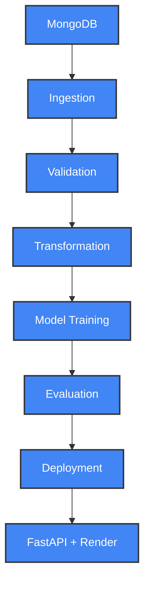
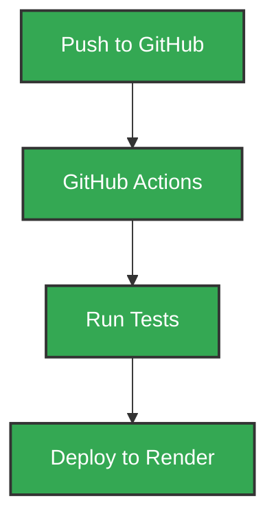

# 🌾 Crop Yield Prediction using ML Workflow

[](https://github.com/Sumanthcs4/Crop-Yield-Prediction/actions/workflows/main.yaml)

---

## 📌 Project Overview

This project focuses on predicting agricultural crop yield using a full machine learning lifecycle — from data ingestion and validation to model deployment. It uses a modular pipeline, supports experiment tracking (MLflow), and is deployed with FastAPI on Render using Docker and GitHub Actions for CI/CD.

The deployed model is a **regression-based estimator**, trained on real-world agricultural features like rainfall, temperature, crop type, and pesticide usage.

---

## 📊 Project Architecture



---

## 🚀 Deployment Pipeline (CI/CD)



---

## 🛠️ Technologies Used

* **Language**: Python 3.11
* **Libraries**: scikit-learn, pandas, numpy, matplotlib, seaborn
* **Web API**: FastAPI + Uvicorn
* **Storage**: MongoDB Atlas
* **MLOps**: MLflow (local), DagsHub (optional)
* **Deployment**: Docker + Render
* **CI/CD**: GitHub Actions

---

## ✨ Features

* Full modular ML pipeline
* Schema validation & drift detection
* MLflow model logging (local)
* REST API for single/batch predictions
* Dockerized, cloud-deployed backend
* GitHub-integrated CI/CD

---

## 📁 Dataset Features

* `Area`: Region of cultivation
* `Crop`: Crop type
* `Season`: Season name
* `Year`: Cultivation year
* `average_rain_fall_mm_per_year`
* `pesticides_tonnes`
* `avg_temp`: Temperature average
* `Item`: Sub-class

---

## 🧪 Setup Instructions

```bash
# 1. Clone the repository
git clone https://github.com/Sumanthcs4/Crop-Yield-Prediction.git
cd Crop-Yield-Prediction

# 2. Set up virtual environment
python -m venv venv
source venv/bin/activate  # Windows: venv\Scripts\activate

# 3. Install dependencies
pip install -r requirements.txt

# 4. Create .env file
MONGO_DB_URL=your_mongodb_url

# 5. Run API locally
uvicorn app:app --reload
```

---

## 💪 Docker Usage

```bash
# Build
docker build -t crop-yield-app .

# Run
docker run -p 8080:8080 crop-yield-app
```

---

## 📆 Project Structure

```bash
Crop-Yield-Prediction/
├── app.py
├── crop_yield/           # Modular pipeline
├── final_model/          # Saved model & preprocessor
├── data_schema/          # schema.yaml
├── templates/            # HTML response template
├── .github/workflows/    # CI/CD config
├── requirements.txt
├── Dockerfile
└── .env.template
```

---

## 📈 Future Work

* [ ] Add schema & prediction tests to CI
* [ ] Re-enable DAGsHub token & MLflow logging
* [ ] Build Streamlit UI
* [ ] Store artifacts in cloud

---

## 👤 Author

**Sumanth CS**
GitHub: [@Sumanthcs4](https://github.com/Sumanthcs4)

---

## 📝 License

Licensed under the MIT License.

```

}

```
