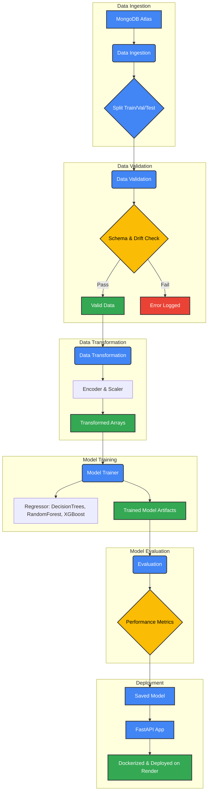
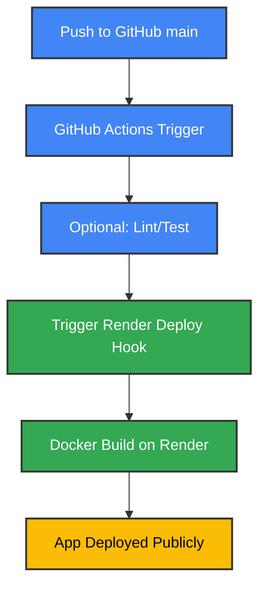

# 🌾 Crop Yield Prediction using ML Workflow

---

## 📌 Project Overview

This project focuses on predicting agricultural crop yield using a full machine learning lifecycle — from data ingestion and validation to model deployment. It uses a modular pipeline, supports experiment tracking (MLflow), and is deployed with FastAPI on Render using Docker and GitHub Actions for CI/CD.

The deployed model is a **regression-based estimator**, trained on real-world agricultural features like rainfall, temperature, crop type, and pesticide usage.

---

## 📐 Project Architecture

---

## 🚀 Deployment Pipeline (CI/CD)

---
// Rest of the content remains unchanged
