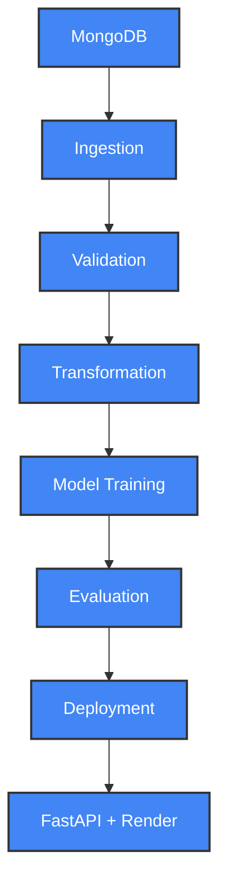
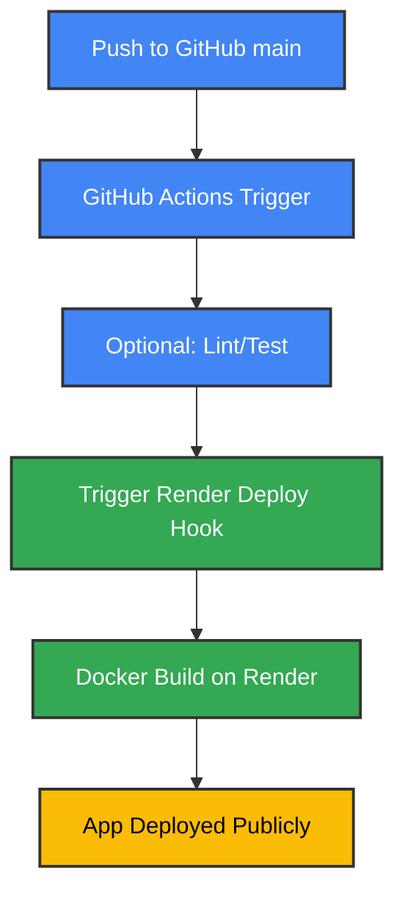
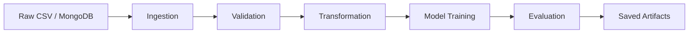

# 🌾 Crop Yield Prediction using ML Workflow

[](https://github.com/Sumanthcs4/Crop-Yield-Prediction/actions/workflows/main.yaml)

---

## 📌 Project Overview

The Crop Yield Prediction project aims to forecast agricultural yield based on environmental and agronomic features. It follows a complete machine learning workflow — including data ingestion from MongoDB, validation against schema and drift, transformation using encoders and scalers, and model training using various regression algorithms. The best-performing model is served through a FastAPI backend and deployed on Render using Docker. MLflow is used locally for experiment tracking, and CI/CD is handled via GitHub Actions.

The deployed model is a **regression-based estimator**, trained on real-world agricultural features like rainfall, temperature, crop type, and pesticide usage.

---

## 🔗 Live Demo

* 🔄 **Try the API (Swagger UI)**:
  👉 [https://crop-yield-prediction-mp03.onrender.com/docs](https://crop-yield-prediction-mp03.onrender.com/docs)

* 🔍 **Direct Predict Route**:
  [POST /predict](https://crop-yield-prediction-mp03.onrender.com/docs#/Prediction/predict_single_predict_post)

---

## 📚 Dataset Source

The dataset used in this project is sourced from Kaggle:

🔗 [Global Crop Yield Prediction Dataset](https://www.kaggle.com/datasets/ameenhasan/global-crop-yield-prediction-dataset-for-analysis/data) by **Ameen Hasan**

This dataset includes historical agricultural data with features like:

* Rainfall, temperature, pesticide usage
* Crop and season types
* Regional and temporal attributes

It serves as the foundation for model training and evaluation in this project.

---

## 📊 Project Architecture



---

## 🚀 Deployment Pipeline (CI/CD)



---

## 🛠️ Technologies Used

* **Language**: Python 3.11
* **Libraries**: scikit-learn, pandas, numpy, matplotlib, seaborn
* **Web API**: FastAPI + Uvicorn
* **Storage**: MongoDB Atlas
* **MLOps**: MLflow (local), DagsHub (optional)
* **Deployment**: Docker + Render
* **CI/CD**: GitHub Actions

---

## ✨ Features

* Full modular ML pipeline
* Schema validation & drift detection
* MLflow model logging (local)
* REST API for single/batch predictions
* Dockerized, cloud-deployed backend
* GitHub-integrated CI/CD

---

## 📁 Dataset Features

* `Area`: Region of cultivation
* `Crop`: Crop type
* `Season`: Season name
* `Year`: Cultivation year
* `average_rain_fall_mm_per_year`
* `pesticides_tonnes`
* `avg_temp`: Temperature average
* `Item`: Sub-class

---

## 🔧 Preprocessing Techniques

During data transformation, the following preprocessing techniques are applied:

* Imputation of missing values
* Label Encoding for categorical features
* Standard Scaling of numerical features
* Transformation to NumPy arrays for model training

---

## 📈 Model Evaluation

The model's performance was evaluated on a holdout test set. The target variable, crop yield, is measured in **kilograms per hectare (kg/ha)**. Below are the metrics from the best run logged via MLflow:

| Metric (Yield in kg/ha) | Train Set | Test Set |
| ----------------------- | --------- | -------- |
| MAE                     | 1900.17   | 4387.63  |
| RMSE                    | —         | 9887.04  |
| R² Score                | 0.9949    | 0.9691   |

📌 These results were obtained using a **RandomForestRegressor**, chosen for its robustness in handling non-linear relationships and its strong performance without extensive tuning. The final model predicts crop yield with a mean absolute error of **4387.63 kg/ha** on unseen test data, explaining over 96% of the variance (\$R^2=0.9691\$).

---

## 📦 ML Pipeline & Artifacts

Each pipeline run produces structured artifacts that can be reused or inspected:

* `data_ingestion/`: raw + split datasets
* `data_validation/`: schema + drift report
* `data_transformation/`: encoded/scaled arrays + preprocessor.pkl
* `model_trainer/`: final model + metrics



---

##  Setup Instructions

```bash
# 1. Clone the repository
git clone https://github.com/Sumanthcs4/Crop-Yield-Prediction.git
cd Crop-Yield-Prediction

# 2. Set up virtual environment
python -m venv venv
source venv/bin/activate  # Windows: venv\Scripts\activate

# 3. Install dependencies
pip install -r requirements.txt

# 4. Create .env file
MONGO_DB_URL=your_mongodb_url

# 5. Run API locally
uvicorn app:app --reload
```

---

## 🔍 Example Prediction

### 🔸 Input JSON

```json
{
  "Area": "Karnataka",
  "Crop": "Rice",
  "Season": "Kharif",
  "Year": 2022,
  "Item": "Paddy",
  "average_rain_fall_mm_per_year": 950,
  "pesticides_tonnes": 210,
  "avg_temp": 28.5
}
```

---

## ⚠️ Notes

* `/predict-batch` expects the same schema as training data
* Model will return `null` for unseen or invalid categories unless handled
* MongoDB used only during training; predictions use local model

---

## 💪 Docker Usage

```bash
# Build
docker build -t crop-yield-app .

# Run
docker run -p 8080:8080 crop-yield-app
```

---

## 📆 Project Structure

```bash
Crop-Yield-Prediction/
├── app.py
├── crop_yield/           # Modular pipeline
├── final_model/          # Saved model & preprocessor
├── data_schema/          # schema.yaml
├── templates/            # HTML response template
├── .github/workflows/    # CI/CD config
├── requirements.txt
├── Dockerfile
└── .env.template
```

---

## 📈 Future Work

* [ ] Add schema & prediction tests to CI
* [ ] Re-enable DAGsHub token & MLflow logging
* [ ] Build Streamlit UI
* [ ] Store artifacts in cloud

---

## 👤 Author

**Sumanth CS**
GitHub: [@Sumanthcs4](https://github.com/Sumanthcs4)

---

## 📜 License

Licensed under the MIT License.
