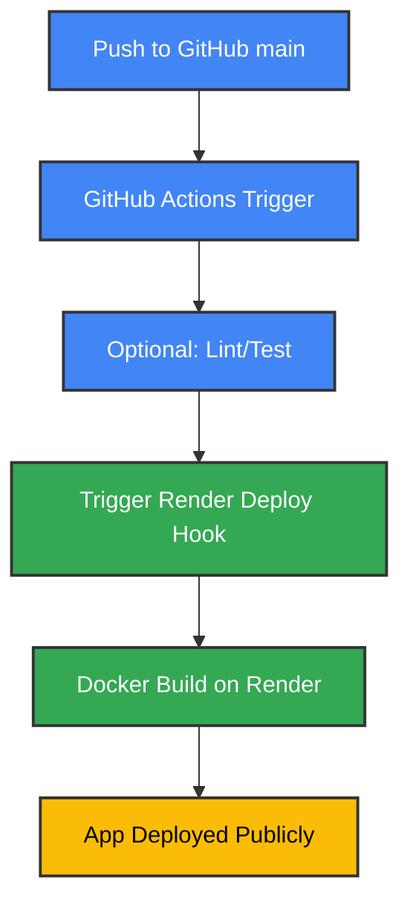

# 🌾 Crop Yield Prediction using ML Workflow

[](https://github.com/Sumanthcs4/Crop-Yield-Prediction/actions/workflows/main.yaml)

---

## 📌 Project Overview

This project focuses on predicting agricultural crop yield using a full machine learning lifecycle — from data ingestion and validation to model deployment. It uses a modular pipeline, supports experiment tracking (MLflow), and is deployed with FastAPI on Render using Docker and GitHub Actions for CI/CD.

The deployed model is a **regression-based estimator**, trained on real-world agricultural features like rainfall, temperature, crop type, and pesticide usage.

---

## 📐 Project Architecture

```mermaid
graph TD
    subgraph "Data Ingestion"
        A[MongoDB Atlas] --> B(Data Ingestion)
        B --> C{Split Train/Val/Test}
    end

    subgraph "Data Validation"
        C --> D(Data Validation)
        D --> E{Schema & Drift Check}
        E -- Pass --> F[Valid Data]
        E -- Fail --> G[Error Logged]
    end

    subgraph "Data Transformation"
        F --> H(Data Transformation)
        H --> I[Encoder & Scaler]
        I --> J[Transformed Arrays]
    end

    subgraph "Model Training"
        J --> K(Model Trainer)
        K --> L[Regressor (e.g., RandomForest)]
        K --> M[Trained Model Artifacts]
    end

    subgraph "Model Evaluation"
        M --> N(Evaluation)
        N --> O{Performance Metrics}
    end

    subgraph "Deployment"
        O --> P[Saved Model]
        P --> Q[FastAPI App]
        Q --> R[Dockerized & Deployed on Render]
    end

    classDef primary fill:#4285f4,stroke:#333,stroke-width:2px,color:white
    classDef success fill:#34a853,stroke:#333,stroke-width:2px,color:white
    classDef warning fill:#fbbc05,stroke:#333,stroke-width:2px,color:black
    classDef error fill:#ea4335,stroke:#333,stroke-width:2px,color:white

    class A,B,C,D,H,K,N,P,Q primary
    class F,J,M,R success
    class E,O warning
    class G error
    class I,L secondary
```

---

## 🚀 Deployment Pipeline (CI/CD)



---

## 🛠 Technologies Used

- **Language**: Python 3.11
- **Libraries**: scikit-learn, pandas, numpy, matplotlib, seaborn
- **Web API**: FastAPI + Uvicorn
- **Storage**: MongoDB Atlas
- **MLOps**: MLflow (locally), DagsHub (optionally)
- **Deployment**: Docker + Render
- **CI/CD**: GitHub Actions

---

## ✨ Features

- Full ML pipeline (ingestion → transformation → training)
- Schema-based validation and drift detection
- Model persistence + preprocessing stack
- RESTful API for prediction (single & batch)
- Dockerized app with `.env.template` for config
- CI/CD via GitHub Actions → Render

---

## 📁 Dataset Features

- `Area`: Region of cultivation (e.g., Tamil Nadu)
- `Crop`: Type of crop (e.g., Rice)
- `Season`: Kharif, Rabi, etc.
- `Year`: Year of cultivation
- `average_rain_fall_mm_per_year`
- `pesticides_tonnes`
- `avg_temp`: Average temperature
- `Item`: Sub-class (e.g., Paddy)

---

## 🧪 Setup Instructions

### 1. Clone the Repo
```bash
git clone https://github.com/Sumanthcs4/Crop-Yield-Prediction.git
cd Crop-Yield-Prediction
```

### 2. Create Virtual Environment
```bash
python -m venv venv
source venv/bin/activate  # or venv\Scripts\activate on Windows
```

### 3. Install Dependencies
```bash
pip install -r requirements.txt
```

### 4. Configure Environment
Create a `.env` file with:
```env
MONGO_DB_URL=your_mongodb_atlas_url
```

### 5. Run Locally
```bash
uvicorn app:app --reload
```

---

## 🐳 Docker Usage

```bash
# Build image
docker build -t crop-yield-app .

# Run container
docker run -p 8080:8080 crop-yield-app
```

---

## 📦 Project Structure

```bash
Crop-Yield-Prediction/
├── app.py                  # FastAPI app entry
├── crop_yield/             # ML pipeline modules
├── final_model/            # Trained model artifacts
├── data_schema/            # schema.yaml
├── templates/              # HTML output for batch
├── requirements.txt
├── Dockerfile
├── .env.template
└── .github/workflows/      # GitHub Actions CI/CD
```

---

## 📌 Future To-Do

- [ ] Add tests for schema validation and API output
- [ ] Re-enable DAGsHub/MLflow integration in cloud
- [ ] Add a Streamlit-based prediction UI
- [ ] Connect experiment logs to remote dashboard

---

## 👤 Author

**Sumanth CS**  
📂 GitHub: [@Sumanthcs4](https://github.com/Sumanthcs4)

---

## 📝 License

Licensed under the MIT License.
